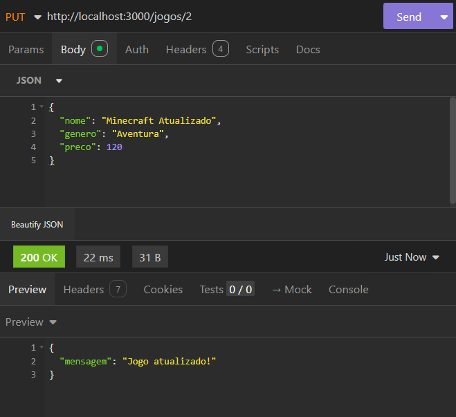
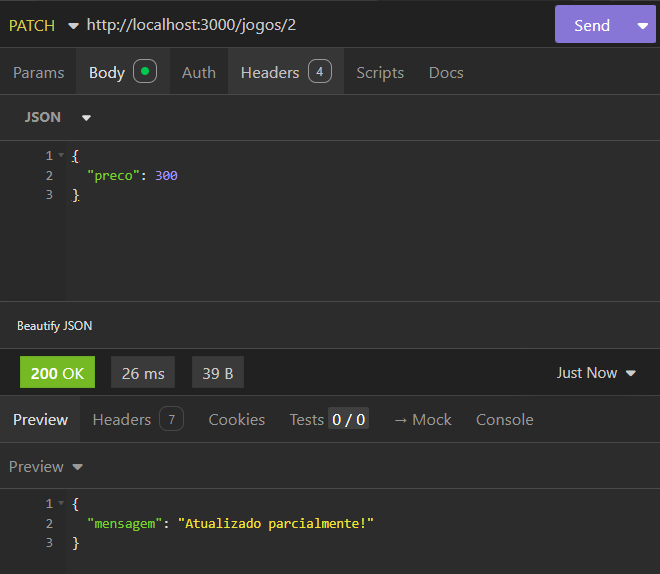

# Atividade-API-Jogos

## Testes no Insomnia

### Deletar jogo (DELETE)

#  API de Jogos

API REST desenvolvida em JavaScript utilizando Node.js, Express e SQLite para gerenciamento de jogos.

---

##  Tecnologias utilizadas

- Node.js
- Express
- SQLite
- Insomnia

---

##  Funcionalidades

- Criar jogo
- Listar jogos
- Buscar jogo por ID
- Atualizar jogo (completo e parcial)
- Deletar jogo

---

## 🧪 Testes no Insomnia

###  Criar jogo (POST)

###  Listar jogos (GET)

###  Atualizar jogo (PUT)

### 🧩 Atualizar parcial (PATCH)

###  Deletar jogo (DELETE)

